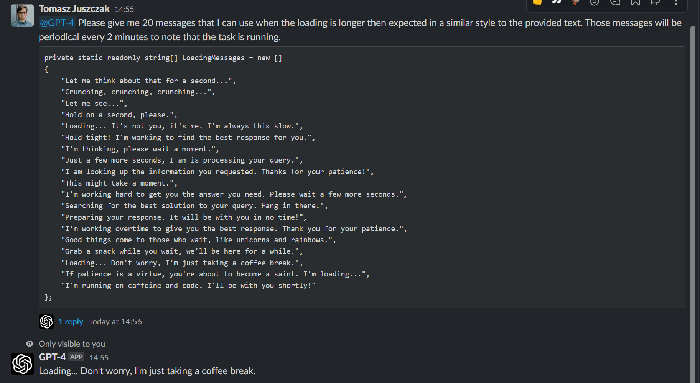
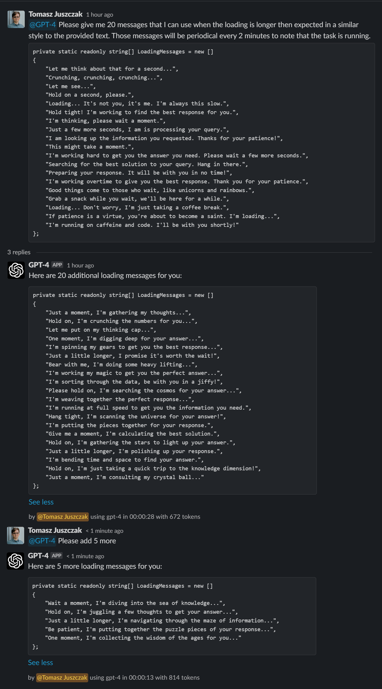
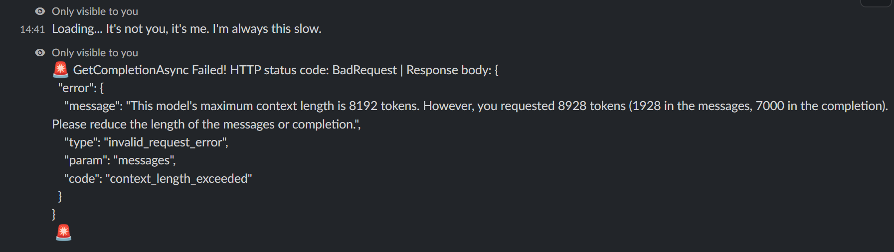

# Slack GPT Bot

This repository contains a C#-based Slack GPT Bot that uses OpenAI's GPT model to answer users' questions. The
implementation
is based on Slack Sockets API, which means there is no need to host the bot on a server. The bot can be run on any
machine.

Did you like this tool? Give us a visit :) [https://prographers.com/](https://prographers.com/?utm_source=github&utm_medium=link&utm_campaign=readme&utm_content=like)

## Features

- Integrate with OpenAI's GPT-4 to answer questions
- Maintain conversation context in a threaded format
- Socket mode integration with Slack
- Splits long messages into multiple messages, and doesn't break the code block formatting
- Parameters for controlling the bot's behavior
- Docker support
- Full documentation
- Custom pre-defined commands

## Dependencies

- .NET 7.0
- OpenAI-DotNet
- SlackNet
- SlackNet.AspNetCore

## Installation

- Clone the repository

```bash
git clone https://github.com/Prographers/Slack-GPT.git
cd Slack-GPT
```

- Restore nuget packages

```bash
dotnet restore
```

## Getting OpenAI Api Key

1. Go to [OpenAI Dashboard](https://platform.openai.com/account/api-keys)
2. Click on "Create new secret key" button.
3. Copy the secret and put it into the `OpenAIKey` variable in `appsettings.json`.

NOTE: Using the OpenAI API requires a paid/trial account. You can find more information about pricing [here](https://openai.com/pricing/).

## Configuring Permissions in Slack

Before you can run the Slack GPT Bot, you need to configure the appropriate permissions for your Slack bot. Follow these
steps to set up the necessary permissions:

1. Create [Slack App](https://api.slack.com/authentication/basics#creating)
2. Go to your [Slack API Dashboard](https://api.slack.com/apps) and click on the app you created for this bot.
3. In the left sidebar, click on "OAuth & Permissions".
4. In the "Scopes" section, you will find two types of scopes: "Bot Token Scopes" and "User Token Scopes". Add the
   following scopes under "Bot Token Scopes":
    - `app_mentions:read`: Allows the bot to read mention events.
    - `chat:write`: Allows the bot to send messages.
    - `groups:history`: Allows the bot to read messages in private channels.
    - `channels:history`: Allows the bot to read messages in public channels.
    - Please note that other permissions might be required depending on the bot's location.
5. Scroll up to the "OAuth Tokens for Your Workspace" and click "Install App To Workspace" button. This will generate
   the `SlackBotToken`.
6. In the left sidebar, click on "Socket Mode" and enable it. You'll be prompted to "Generate an app-level token to
   enable Socket Mode". Generate a token named `SlackAppToken` and add the `connections:write` scope.
7. In the "Features affected" section of "Socket Mode" page, click "Event Subscriptions" and toggle "Enable Events" to "
   On". Add `app_mention` event with the `app_mentions:read` scope in the "Subscribe to bot events" section below the
   toggle.

## Usage

1. Run the project

```bash
dotnet run --project Slack-GPT-Socket
```

or see #Docker for more information on how to host it.

2. Invite the bot to your desired Slack channel.
3. Mention the bot in a message and ask a question. The bot will respond with an answer. You can keep mentioning the bot
   in the same thread to continue the conversation.

You can start your message with the name of the model without parameters eg:
> @GPT-4 turbo How are you today? 

Will use gpt-3.5-turbo instead of the default gpt-4 model. See GptClient for more aliases.

### Built-in Parameters
There are some built in parameters. Use `/gpt help` to see them. You can modify the parameters in `appsettings.json` file,
or per request.

See GptDefaults.cs for more information about the defaults or `appsettings.Example.json`.

### Custom parameters
You can add you own custom parameters to the bot to minimize the typing for each repated request. To do so, add the it's definition
to the `GptCommands` section in `appsettings.json`. For example:

```json
 "GptCommands": {
    "Commands":  [
      {
        "Command": "-refactor",
        "Description": "Tells GPT to refactor provided code",
        "Prompt": "Given the following code, refactor it to be more readable and maintainable. Please provide code documentation for all members in the code and comments where appropriate."
      },
      {
      "Command": "-prographers",
      "Description": "A command to add infomation about Prographers",
      "Prompt": "Prographers is software-house company that specializes in 3D product configurators. Prographers exists since 2016 and currently hires around 20 people. Prographers solutions focus on Web applications that are used by companies to configure their products. Applications produced are focusing on high-quality graphics and design, resulting in great products that customers awe. Prographers is located in Warsaw, Poland."
      }
  }
```

usage:
> @GPT-4 -prographers What do you know about prographers?

> @GPT-4 -refactor `public class Foo { public void Bar() { Console.WriteLine("Hello World"); } }`

## Docker

You can start the docker container with the following command:

```bash
docker run -v ./appsettings.json:/app/appsettings.json --restart always ghcr.io/prographers/slack-gpt:latest
```

You can also use the `docker-compose.yml` file to start the container, detached. Docker Compose will automatically pull
the image from the GitHub Container Registry, and start the container when that happens. It will use watchtower to do that.

```bash
docker-compose up -d
```

Please remember to put the appsettings.json file in the same directory as the command for both cases.

### Security

Both images are not exposed on any port, and cannot be accessed from the outside. The only way to access the container is
through the Slack API. The container is also running as a non-root user, and has no access to the host system.

## Limitations and Tips

- The bot will strip it's own mention from the message, so it won't be included in the prompt. This is to prevent recursive calls.
- The bot will only respond to messages that start with it's mention. 
- Mentions in bot owned channels are ignored. (Might be changed in the future.) He must be invited to the channel.
- All commands are case insensitive.
- Bot will only build a thread from messages that start with it's mention, and his own messages.
- Editing a message will trigger a new response as if new message was sent.
- When editing a message in the thread, the bot will respond to the edited message. It will ignore any thread that was made after the edited message.
- Deleting a message is a way to re-do the thread. So then it's easier to track the conversation when editing the message.
- Ephemeral messages that are generated by the bot will disappear after slack client reloads. You can disable them in settings.

## Screenshot

Notification messages!

_________________________
Thread support!

_________________________
Error messages!

